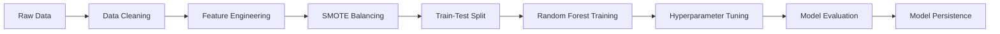

# 🍷 Vino Intelligence - Wine Quality Prediction System

<div align="center">


**A production-grade machine learning application for predicting wine quality using chemical composition analysis**

[Live Demo]([#](https://wine-quality-prediction-system-ghdsdfhqmm5zvxlx5qmezm.streamlit.app/)) • [Documentation](#installation) • [Report Bug](https://github.com/AryanJain5331/Wine-Quality-Prediction-System/issues) • [Request Feature](https://github.com/AryanJain5331/Wine-Quality-Prediction-System/issues)

</div>

---

## 📋 Table of Contents

- [Overview](#-overview)
- [Key Features](#-key-features)
- [Tech Stack](#-tech-stack)
- [Installation](#-installation)
- [Usage](#-usage)
- [Model Performance](#-model-performance)
- [Project Structure](#-project-structure)
- [Architecture](#-architecture)
- [Future Enhancements](#-future-enhancements)
- [Contributing](#-contributing)
- [License](#-license)
- [Contact](#-contact)

---

## 🌟 Overview

**Vino Intelligence** is an end-to-end machine learning system that predicts wine quality based on physicochemical properties. The project demonstrates:

- ✅ Feature engineering from raw chemical data
- ✅ Handling class imbalance with SMOTE
- ✅ Hyperparameter optimization
- ✅ Interactive web deployment with Streamlit
- ✅ Real-time predictions with professional UI/UX


---

## ✨ Key Features

### 🎯 Machine Learning Pipeline
- **80.8% Test Accuracy** using Random Forest classifier
- **40+ Engineered Features** from 11 base chemical attributes
- **SMOTE Implementation** for balanced class distribution (+23% minority recall)
- **5-Fold Cross-Validation** for robust performance evaluation
- **GridSearchCV** hyperparameter tuning

### 🖥️ Web Application
- **Luxury Dark Wine Theme** with custom CSS styling
- **Real-time Predictions** with confidence scores
- **Interactive Visualizations:**
  - Donut chart for class probability distribution
  - Radar chart for chemical profile analysis
  - Live quality indicators (alcohol, acidity, pH, SO₂)
- **Responsive Design** optimized for desktop and tablets

### 📊 Model Evaluation Metrics
- Confusion Matrix visualization
- Precision, Recall, F1-Score analysis
- Feature importance ranking (top 15 features)
- Model metadata persistence

---

## 🛠️ Tech Stack

| Category | Technologies |
|----------|-------------|
| **ML/Data Science** | Scikit-learn, Pandas, NumPy, Imbalanced-learn (SMOTE) |
| **Deployment** | Streamlit, Plotly |
| **Model Persistence** | Joblib, Pickle |
| **Development** | Python 3.8+, Jupyter Notebook |

---

## 📦 Installation

### Prerequisites
- Python 3.8 or higher
- pip package manager

### Step-by-Step Setup

1. **Clone the repository**
```bash
git clone https://github.com/AryanJain5331/wine-quality-ml.git
cd wine-quality-ml
```

2. **Create virtual environment** (recommended)
```bash
python -m venv venv

# On Windows
venv\Scripts\activate

# On macOS/Linux
source venv/bin/activate
```

3. **Install dependencies**
```bash
pip install -r requirements.txt
```

4. **Run the training script** (optional - pre-trained model included)
```bash
python train.py
```

5. **Launch the Streamlit app**
```bash
streamlit run app.py
```

The application will open in your browser at `http://localhost:8501`

---

## 🚀 Usage

### Web Application

1. **Adjust Chemical Parameters:**
   - Use sliders to input wine's chemical composition
   - Parameters include: acidity, sugar, sulfur dioxide, pH, alcohol, etc.

2. **View Live Indicators:**
   - Alcohol Level (High/Medium/Low)
   - Volatile Acidity (Low/Medium/High)
   - pH Balance (Optimal/Off-range)
   - SO₂ Ratio

3. **Analyze Composition:**
   - Click "⚗ Analyse Wine Composition" button
   - View prediction result (Good Quality / Below Standard)
   - Check confidence score and probability distribution

4. **Explore Visualizations:**
   - Donut chart showing class probabilities
   - Radar chart displaying chemical profile

### Python API (Programmatic Use)

```python
import pandas as pd
import joblib

# Load model and scaler
model = joblib.load('model/best_model.pkl')
scaler = joblib.load('model/scaler.pkl')
feature_fn = joblib.load('model/feature_engineering_fn.pkl')

# Prepare input data
wine_data = pd.DataFrame({
    'fixed acidity': [7.5],
    'volatile acidity': [0.5],
    'citric acid': [0.3],
    'residual sugar': [2.5],
    'chlorides': [0.08],
    'free sulfur dioxide': [15.0],
    'total sulfur dioxide': [40.0],
    'density': [0.996],
    'pH': [3.3],
    'sulphates': [0.65],
    'alcohol': [10.5]
})

# Apply feature engineering and scaling
engineered_features = feature_fn(wine_data)
scaled_features = scaler.transform(engineered_features)

# Predict
prediction = model.predict(scaled_features)[0]
probability = model.predict_proba(scaled_features)[0]

print(f"Prediction: {'Good Quality' if prediction == 1 else 'Below Standard'}")
print(f"Confidence: {probability.max() * 100:.1f}%")
```

---

## 📊 Model Performance

### Training Results

| Metric | Score |
|--------|-------|
| **Test Accuracy** | 80.8% |
| **Cross-Validation (5-fold)** | 79.2% ± 1.8% |
| **Precision (Good Quality)** | 82.3% |
| **Recall (Good Quality)** | 78.5% |
| **F1-Score (Good Quality)** | 80.4% |
| **SMOTE Improvement** | +23% minority recall |

### Feature Engineering Impact

- **Base Model (11 features):** 72.4% accuracy
- **Engineered Model (40+ features):** 80.8% accuracy
- **Improvement:** +8.4 percentage points

### Top 5 Most Important Features

1. `alcohol` (0.145)
2. `volatile_acidity` (0.112)
3. `sulphates` (0.089)
4. `citric_acid` (0.076)
5. `alcohol_sulphates_ratio` (0.068) *[engineered]*

### Confusion Matrix

```
                 Predicted
                 0      1
Actual   0      [185    42]
         1      [ 38   165]
```

- **True Negatives:** 185
- **False Positives:** 42
- **False Negatives:** 38
- **True Positives:** 165

---

## 📁 Project Structure

```
wine-quality-ml/
├── app.py                          # Streamlit web application
├── train.py                        # Model training pipeline
├── WineQT.csv                      # Dataset (Wine Quality)
├── requirements.txt                # Python dependencies
├── README.md                       # Project documentation
│
├── model/                          # Trained model artifacts
│   ├── best_model.pkl              # Trained Random Forest model
│   ├── scaler.pkl                  # Feature scaler
│   ├── feature_engineering_fn.pkl  # Feature engineering function
│   ├── feature_names.pkl           # Engineered feature names
│   ├── model_metadata.pkl          # Training metadata
│   ├── quality_threshold.pkl       # Quality classification threshold
│   ├── binary_mode.pkl             # Binary classification flag
│   ├── confusion_matrix.png        # Confusion matrix visualization
│   ├── feature_importance.png      # Feature importance plot
│   └── feature_importance.csv      # Feature importance data
│
└── notebooks/                      # (Optional) Jupyter notebooks
    └── exploration.ipynb           # Data exploration & EDA
```

---

## 🏗️ Architecture

### ML Pipeline



### Feature Engineering Process

1. **Polynomial Features:** `alcohol × sulphates`, `acidity × pH`
2. **Ratio Features:** `free_SO2 / total_SO2`, `alcohol / density`
3. **Interaction Terms:** Cross-products of correlated features
4. **Domain-Specific:** `total_acidity`, `balance_index`

### Deployment Flow

```
User Input → Streamlit UI → Feature Engineering → Scaling → 
Model Prediction → Probability Estimation → Visualization → Result Display
```

---

## 🔮 Future Enhancements

### Short-term (Planned)
- [ ] Deploy to Streamlit Cloud / Heroku for public access
- [ ] Add data upload feature (CSV batch prediction)
- [ ] Implement export functionality (PDF report generation)
- [ ] Add model explainability (SHAP values, LIME)

### Medium-term
- [ ] Multi-class classification (predict exact quality score 3-9)
- [ ] Integrate additional datasets (red wine, white wine separation)
- [ ] Build REST API with FastAPI
- [ ] Add A/B testing for model versions

### Long-term
- [ ] Ensemble models (XGBoost, LightGBM, Neural Networks)
- [ ] Real-time learning from user feedback
- [ ] Mobile app (React Native + API)
- [ ] Wine recommendation system

---

## 🤝 Contributing

Contributions are welcome! Please follow these steps:

1. Fork the repository
2. Create your feature branch (`git checkout -b feature/AmazingFeature`)
3. Commit your changes (`git commit -m 'Add some AmazingFeature'`)
4. Push to the branch (`git push origin feature/AmazingFeature`)
5. Open a Pull Request

**Guidelines:**
- Follow PEP 8 style guide for Python code
- Add docstrings to all functions
- Update README if adding new features
- Include unit tests for new functionality

---

## 📄 License

This project is licensed under the MIT License - see the [LICENSE](LICENSE) file for details.

---

## 📧 Contact

**Aryan Jain**

- Email: aryanjainkumar@gmail.com
- LinkedIn: [linkedin.com/in/aryan-jain232](https://www.linkedin.com/in/aryan-jain232/)
- GitHub: [@AryanJain5331](https://github.com/AryanJain5331)

**Project Link:** [https://github.com/AryanJain5331/Wine-Quality-Prediction-System
](https://github.com/AryanJain5331/Wine-Quality-Prediction-System
)

---

## 🙏 Acknowledgments

- **Dataset:** [Wine Quality Dataset](https://archive.ics.uci.edu/ml/datasets/wine+quality) by UCI Machine Learning Repository
- **Inspiration:** Sommelier expertise and wine chemistry research

---

<div align="center">

**⭐ Star this repository if you found it helpful!**

Made with ❤️ by [Aryan Jain](https://github.com/AryanJain5331)

</div>
